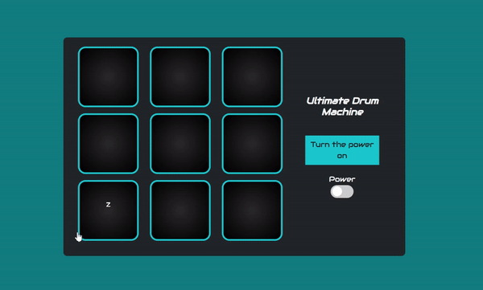

# react-drum-machine 🥁

## Overview 📄
This is a simple drum machine using React.js. It works using mouse clicks and keyboard keys (Q, W, E, A, S, D, Z, X, and C). The app is responsive on all devices.


## Installation ⬇️

1 - Clone the repository or download the source code.

2 - Navigate to the project directory using your terminal.

```
cd random-quotes-app
```

3- Install the required dependencies.

```
npm install
```

4- Start the development server.

```
npm start
```

5- Open your web browser and navigate to http://localhost:3000 to see the app in action.


## Usage 👐

- Turn on the power.
- Play the drums.


## Demo 📹




## Structure 🌲

- **index.html**: includes HTML core
- **src**:
  - **App.jsx**: includes the react components code
  - **main.jsx**: responsible for the rendering
  - **style.css**: stylesheet


## Technologies Used 💻

 __React.js__


## Pre-requisites & used libraries :grey_question:
- Node.js (version 14 or higher)
- npm (version 6 or higher)
- React 18 is used


## Link 🔗
<a href='https://mariamatef226.github.io/react-drum-machine/'>Click Me!</a>


## Author 🖊️

**Mariam Atef Hassan  - 2023**

<hr>

#### Enjoy :wink:

